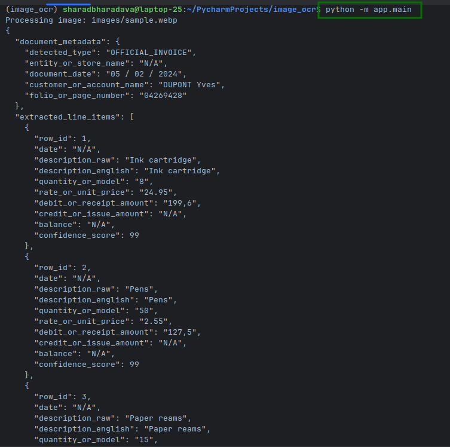
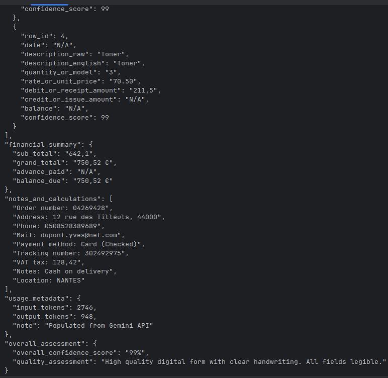

# Image OCR System - Multi-Language Document Extraction

A production-ready OCR (Optical Character Recognition) system designed to extract structured data from handwritten and printed business documents in English, Hindi (Devanagari), and mixed Hinglish formats. Built with Google Gemini AI for intelligent document understanding and data extraction.

---

## 📋 Table of Contents

- [Requirements & Problem Statement](#requirements--problem-statement)
- [Solution Overview](#solution-overview)
- [Architecture](#architecture)
- [Tech Stack & Rationale](#tech-stack--rationale)
- [Project Structure](#project-structure)
- [System Architecture Diagrams](#system-architecture-diagrams)
- [Component Details](#component-details)
- [Setup & Installation](#setup--installation)
- [Usage](#usage)
- [Features](#features)
- [Error Handling](#error-handling)
- [Performance Optimizations](#performance-optimizations)

---

## 🎯 Requirements & Problem Statement

### Business Requirements

1. **Multi-Language Support**: Extract text from documents containing:
   - English text
   - Hindi (Devanagari script)
   - Mixed Hinglish (Hindi written in English script)

2. **Document Type Detection**: Automatically classify documents into:
   - Official Invoices (printed/handwritten bills, purchase orders)
   - Stock Registers (tabular stock pages with Receipt/Issue/Balance)
   - Ledger Pages (financial accounts with Debit/Credit columns)
   - Index Pages (name lists with page numbers)
   - Rough Estimates/Notes (informal handwritten notes)

3. **Structured Data Extraction**: Extract all visible information into a standardized JSON format with:
   - Document metadata (type, date, entity name, customer name, page numbers)
   - Line items with quantities, rates, amounts, balances
   - Financial summaries (subtotals, grand totals, advances, balances due)
   - Confidence scores for each extracted field
   - Transliteration of Hindi text to English

4. **Production-Ready Requirements**:
   - Robust error handling and validation
   - Retry logic for API failures
   - Input validation
   - Type safety
   - Resource efficiency
   - Maintainable and extensible codebase

### Challenges Addressed

- **Handwriting Recognition**: Traditional OCR struggles with handwritten text, especially in non-Latin scripts
- **Multi-Language Processing**: Handling mixed scripts (Devanagari + English) in single documents
- **Context Understanding**: Extracting structured data requires understanding document context, not just text recognition
- **Data Quality**: Ensuring accurate extraction with confidence scoring
- **Reliability**: Handling API failures, network issues, and invalid inputs gracefully

---

## 💡 Solution Overview

We built a **layered architecture** that combines:

1. **Google Gemini AI**: Advanced multimodal AI model capable of understanding images, context, and extracting structured data
2. **Structured Prompting**: Carefully crafted prompts that guide the AI to extract data in a consistent JSON format
3. **Production-Ready Infrastructure**: Error handling, retry logic, validation, and caching for reliability and performance
4. **Type-Safe Design**: Full type hints for maintainability and IDE support

### Key Design Decisions

- **Abstraction Layer**: Base `OCRClient` interface allows swapping AI providers without changing pipeline code
- **Singleton Pattern**: OCR client reuse reduces initialization overhead
- **Prompt Caching**: Prompts loaded once and cached in memory
- **Exponential Backoff**: Retry logic with increasing delays (2s, 4s, 8s) for transient failures
- **Custom Exception Hierarchy**: Granular error types for better error handling and debugging

---

## 🏗 Architecture

### Architectural Patterns & Structure

This system implements a **multi-pattern architecture** combining several well-established design patterns and architectural principles:

#### 1. **Layered Architecture Pattern**
The system follows a **3-tier layered architecture** with strict separation of concerns:

- **Presentation/Application Layer**: Handles user interaction, input/output formatting (`main.py`)
- **Business Logic/Pipeline Layer**: Orchestrates workflows and business rules (`pipeline.py`)
- **Data Access/Service Layer**: Interfaces with external services and data sources (`ocr/`, `processors/`, `utils/`)

**Benefits**:
- Clear separation of concerns
- Easy to test each layer independently
- Maintainable and scalable structure
- Allows swapping implementations at any layer

#### 2. **Strategy Pattern** (via Abstract Base Class)
Implemented through the `OCRClient` abstract base class, allowing different OCR providers to be swapped without changing the pipeline code.

**Implementation**: `app/ocr/base.py` defines the interface, `app/ocr/gemini_client.py` provides the concrete implementation.

**Benefits**:
- Open/Closed Principle: Open for extension, closed for modification
- Easy to add new OCR providers (OpenAI, Azure, etc.)
- Testable with mock implementations

#### 3. **Singleton Pattern**
The `GeminiOCRClient` uses a singleton pattern to ensure only one instance exists throughout the application lifecycle.

**Implementation**: `__new__` method ensures single instance, `_instance` class variable stores the instance.

**Benefits**:
- Resource efficiency (single API client connection)
- Reduced memory footprint
- Consistent state across requests
- Performance optimization (no repeated initialization)

#### 4. **Repository Pattern** (for Prompts)
Prompts are managed through a caching mechanism that acts like a repository, abstracting file I/O operations.

**Implementation**: `_PROMPT_CACHE` dictionary in `pipeline.py` with `_get_cached_prompt()` method.

**Benefits**:
- Abstracts data access logic
- Improves performance through caching
- Easy to modify data source (file → database → API)

#### 5. **Dependency Injection** (Implicit)
Components receive their dependencies rather than creating them directly.

**Implementation**: 
- Pipeline receives OCR client (can be injected)
- Settings are accessed via class methods (not instantiated)
- Validation functions are pure functions (no dependencies)

**Benefits**:
- Loose coupling between components
- Easy to test with mocks
- Flexible configuration

#### 6. **Factory Pattern** (Implicit)
The singleton pattern combined with lazy initialization acts as a factory for creating OCR clients.

**Implementation**: `GeminiOCRClient()` call returns existing or creates new instance.

**Benefits**:
- Centralized object creation logic
- Consistent initialization
- Resource management

#### 7. **Template Method Pattern**
The pipeline defines the algorithm structure (template), with specific steps implemented by different components.

**Implementation**: `run_pipeline()` defines the workflow, delegates to specific processors.

**Benefits**:
- Consistent workflow execution
- Easy to modify individual steps
- Clear algorithm structure

#### 8. **Separation of Concerns (SoC)**
Each module has a single, well-defined responsibility:
- `main.py`: Application entry and output
- `pipeline.py`: Workflow orchestration
- `ocr/`: OCR provider abstraction
- `processors/`: Data processing
- `utils/`: Reusable utilities
- `config/`: Configuration management
- `exceptions.py`: Error definitions

#### 9. **Single Responsibility Principle (SRP)**
Each class and function has one reason to change:
- `ImageLoader`: Only loads images
- `ValidationUtils`: Only validates inputs
- `Settings`: Only manages configuration
- `GeminiOCRClient`: Only interfaces with Gemini API

#### 10. **Error Handling Pattern**
Custom exception hierarchy with proper exception chaining follows the **Fail-Fast** and **Exception Translation** patterns.

**Implementation**: Base `OCRException` with specific subclasses, exception chaining preserves stack traces.

**Benefits**:
- Granular error handling
- Clear error messages
- Proper error propagation
- Debugging-friendly stack traces

### High-Level Architecture

The system follows a **layered architecture pattern** with clear separation of concerns:

```
┌─────────────────────────────────────────────────────────────┐
│                        Application Layer                      │
│  (main.py) - Entry point, orchestration, output formatting   │
└────────────────────────────┬──────────────────────────────────┘
                             │
┌────────────────────────────▼──────────────────────────────────┐
│                      Pipeline Layer                           │
│  (pipeline.py) - Orchestrates workflow, manages state        │
└────────────────────────────┬──────────────────────────────────┘
                             │
        ┌────────────────────┼────────────────────┐
        │                    │                    │
┌───────▼────────┐  ┌────────▼────────┐  ┌────────▼────────┐
│  Image Loader  │  │  Prompt Manager │  │   OCR Client    │
│  (processors)  │  │   (cached)      │  │   (singleton)   │
└────────────────┘  └─────────────────┘  └────────┬────────┘
                                                    │
                                    ┌───────────────┼───────────────┐
                                    │               │               │
                          ┌─────────▼────┐  ┌──────▼──────┐  ┌─────▼──────┐
                          │  Validation  │  │  Settings   │  │  Exceptions│
                          │  (utils)     │  │  (config)    │  │             │
                          └──────────────┘  └──────────────┘  └─────────────┘
```

### Architecture Type Summary

**Primary Architecture**: **Layered Architecture (3-Tier)**
- Application Layer
- Business Logic Layer  
- Data Access Layer

**Design Patterns Used**:
1. Strategy Pattern (OCR provider abstraction)
2. Singleton Pattern (OCR client instance)
3. Repository Pattern (Prompt caching)
4. Factory Pattern (Client creation)
5. Template Method Pattern (Pipeline workflow)
6. Dependency Injection (Component dependencies)

**Architectural Principles**:
- Separation of Concerns (SoC)
- Single Responsibility Principle (SRP)
- Open/Closed Principle (OCP)
- Dependency Inversion Principle (DIP)
- Don't Repeat Yourself (DRY)

**Code Organization**: **Modular/Package-based Structure**
- Organized by feature/domain (ocr, processors, utils, config)
- Clear module boundaries
- Reusable components

### Component Responsibilities

1. **Application Layer** (`main.py`): Entry point, handles CLI arguments, formats output
2. **Pipeline Layer** (`pipeline.py`): Orchestrates the extraction workflow
3. **Image Processing** (`processors/image_loader.py`): Loads and validates images
4. **OCR Client** (`ocr/gemini_client.py`): Interfaces with Gemini API with retry logic
5. **Validation** (`utils/validation.py`): Input validation for paths and images
6. **Configuration** (`config/settings.py`): Environment-based configuration management
7. **Exception Handling** (`exceptions.py`): Custom exception hierarchy

---

## 🛠 Tech Stack & Rationale

### Core Technologies

| Technology | Version | Purpose | Rationale |
|------------|---------|---------|-----------|
| **Python** | 3.8+ | Programming Language | Industry standard for AI/ML, excellent library ecosystem |
| **Google GenAI SDK** | 1.59.0 | AI/OCR Engine | State-of-the-art multimodal AI, excellent handwriting recognition, supports JSON output |
| **Pillow (PIL)** | 12.1.0 | Image Processing | Industry-standard Python image library, reliable format support |
| **Tenacity** | 9.1.2 | Retry Logic | Robust retry library with exponential backoff, battle-tested |
| **python-dotenv** | 1.2.1 | Configuration | Secure environment variable management, no hardcoded secrets |
| **Pydantic** | 2.12.5 | Data Validation | Type validation and serialization (via dependencies) |

### Why These Technologies?

#### Google Gemini AI
- **Multimodal Understanding**: Processes images directly without preprocessing
- **Context Awareness**: Understands document structure, not just text
- **Multi-Language**: Excellent support for Devanagari and mixed scripts
- **Structured Output**: Native JSON response format
- **State-of-the-Art**: Latest generation AI model with superior accuracy

#### Python
- **Rapid Development**: Fast iteration and prototyping
- **Rich Ecosystem**: Extensive libraries for AI, image processing, and utilities
- **Type Hints**: Modern Python with full type safety support
- **Maintainability**: Clean, readable code with strong community support

#### Tenacity (Retry Library)
- **Exponential Backoff**: Prevents overwhelming API during outages
- **Configurable**: Easy to adjust retry attempts and delays
- **Exception Filtering**: Only retries on appropriate errors
- **Production-Ready**: Used by major Python projects

#### Singleton Pattern for OCR Client
- **Resource Efficiency**: Reuses API client connection
- **Performance**: Avoids repeated initialization overhead
- **Cost Optimization**: Single client instance reduces memory footprint

#### Prompt Caching
- **Performance**: Avoids repeated file I/O operations
- **Efficiency**: Prompts loaded once, reused across requests
- **Scalability**: Better performance under load

---

## 📁 Project Structure

```
image_ocr/
│
├── app/                          # Main application package
│   ├── __init__.py
│   ├── main.py                   # Application entry point
│   ├── pipeline.py               # Core pipeline orchestration
│   ├── exceptions.py             # Custom exception hierarchy
│   │
│   ├── config/                   # Configuration management
│   │   ├── __init__.py
│   │   └── settings.py          # Environment-based settings
│   │
│   ├── ocr/                      # OCR client implementations
│   │   ├── __init__.py
│   │   ├── base.py              # Abstract OCR client interface
│   │   └── gemini_client.py     # Google Gemini implementation
│   │
│   ├── processors/               # Data processors
│   │   ├── __init__.py
│   │   └── image_loader.py      # Image loading and validation
│   │
│   ├── prompts/                  # AI prompts
│   │   ├── system.txt           # System prompt (document rules)
│   │   └── extraction.txt       # User prompt (extraction instructions)
│   │
│   └── utils/                    # Utility functions
│       ├── __init__.py
│       ├── file_utils.py        # File reading utilities
│       └── validation.py        # Input validation functions
│
├── images/                       # Sample images directory
│   └── sample.webp              # Test image
│
├── screenshots/                  # Documentation assets
│   ├── graph.svg                 # System architecture diagram
│   ├── output_1.png              # Example output 1
│   └── output_2.png              # Example output 2
│
├── requirements.txt              # Python dependencies
└── README.md                    # This file
```

### Directory Purpose

- **`app/`**: Main application code, follows Python package structure
- **`app/config/`**: Configuration management, environment variable handling
- **`app/ocr/`**: OCR provider abstractions, allows swapping AI providers
- **`app/processors/`**: Data processing components (image loading, future: preprocessing)
- **`app/prompts/`**: AI prompts stored as text files for easy modification
- **`app/utils/`**: Reusable utility functions (validation, file operations)
- **`images/`**: Sample/test images for development and testing

---

## 📊 System Architecture Diagrams

### System Architecture Overview

The following diagram illustrates the complete system architecture, including all components, data flows, and interactions:



This diagram shows:
- **Application Flow**: From user input to final output
- **Component Interactions**: How different modules communicate
- **Error Handling**: Error propagation and handling paths
- **Data Flow**: How data moves through the system
- **Caching Strategy**: Prompt caching and singleton pattern implementation
- **Retry Logic**: API retry mechanism with exponential backoff

---

## 🔧 Component Details

### 1. Main Application (`app/main.py`)

**Purpose**: Application entry point and orchestration

**Key Features**:
- Static image path configuration
- Error handling and user-friendly error messages
- JSON output formatting

**Code Structure**:
```python
def main():
    image_path = "images/sample.webp"
    print(f"Processing image: {image_path}")
    result = run_pipeline(image_path)
    print(json.dumps(result, indent=2, ensure_ascii=False))
```

### 2. Pipeline (`app/pipeline.py`)

**Purpose**: Orchestrates the entire OCR workflow

**Key Features**:
- Prompt caching for performance
- Exception handling and propagation
- Usage metadata enrichment

**Workflow**:
1. Load and validate image
2. Get cached prompts (system + user)
3. Initialize OCR client (singleton)
4. Call extraction API
5. Parse JSON response
6. Add usage metadata
7. Return structured data

### 3. OCR Client (`app/ocr/gemini_client.py`)

**Purpose**: Interface with Google Gemini API

**Key Features**:
- **Singleton Pattern**: Single instance reused across requests
- **Retry Logic**: 3 attempts with exponential backoff (2s, 4s, 8s)
- **Error Handling**: Converts API exceptions to custom `APIError`
- **Safety Filter Checking**: Validates prompt feedback for blocked content

**Retry Strategy**:
- Maximum 3 attempts
- Exponential backoff: 2s → 4s → 8s
- Only retries on `APIError` (not configuration errors)

### 4. Image Loader (`app/processors/image_loader.py`)

**Purpose**: Load and validate image files

**Key Features**:
- Path validation (existence, readability)
- Image format validation
- Error handling with custom exceptions

**Supported Formats**: All formats supported by PIL (JPEG, PNG, WEBP, etc.)

### 5. Validation Utilities (`app/utils/validation.py`)

**Purpose**: Input validation functions

**Functions**:
- `validate_image_path()`: Validates file path exists and is readable
- `validate_image_format()`: Validates image format and dimensions
- `get_image_info()`: Extracts image metadata

### 6. Settings (`app/config/settings.py`)

**Purpose**: Configuration management

**Key Features**:
- **Lazy Loading**: Environment variables loaded only when accessed
- **Caching**: Settings cached after first access
- **Validation**: Raises `ConfigurationError` if required vars missing
- **No Side Effects**: No prints or operations on import

**Required Environment Variables**:
- `GEMINI_API_KEY`: Google Gemini API key
- `GEMINI_MODEL`: Model ID (e.g., "gemini-1.5-pro")
- `TEMPERATURE`: Model temperature (default: 0.0)
- `TOP_P`: Top-p sampling parameter (default: 0.1)

### 7. Exception Hierarchy (`app/exceptions.py`)

**Purpose**: Custom exception types for granular error handling

**Exception Types**:
- `OCRException`: Base exception for all OCR operations
- `ImageLoadError`: Image loading/validation failures
- `APIError`: API call failures
- `ValidationError`: Input validation failures
- `ConfigurationError`: Configuration issues
- `JSONParseError`: JSON parsing failures

### 8. Base OCR Interface (`app/ocr/base.py`)

**Purpose**: Abstract base class for OCR implementations

**Benefits**:
- Allows swapping AI providers without changing pipeline code
- Enforces consistent interface across implementations
- Enables testing with mock implementations

---

## 🚀 Setup & Installation

### Prerequisites

- Python 3.8 or higher
- Google Gemini API key
- Virtual environment (recommended)

### Installation Steps

1. **Clone or navigate to the project directory**:
```bash
cd /path/to/image_ocr
```

2. **Create virtual environment** (recommended):
```bash
python3 -m venv venv
source venv/bin/activate  # On Windows: venv\Scripts\activate
```

3. **Install dependencies**:
```bash
pip install -r requirements.txt
```

4. **Set up environment variables**:
Create a `.env` file in the project root:
```env
GEMINI_API_KEY=your_api_key_here
GEMINI_MODEL=gemini-1.5-pro
TEMPERATURE=0.0
TOP_P=0.1
```

5. **Verify installation**:
```bash
python -m app.main
```

---

## 📖 Usage

### Basic Usage

Run the application with the default image:
```bash
python -m app.main
```

The system will:
1. Load the image from `images/sample.webp`
2. Process it through the OCR pipeline
3. Display the extracted structured JSON data

### Output Format

The system outputs a JSON object with the following structure:

```json
{
  "document_metadata": {
    "detected_type": "OFFICIAL_INVOICE",
    "entity_or_store_name": "Store Name",
    "document_date": "2024-01-15",
    "customer_or_account_name": "Customer Name",
    "folio_or_page_number": "1"
  },
  "extracted_line_items": [
    {
      "row_id": 1,
      "date": "2024-01-15",
      "description_raw": "Item Name",
      "description_english": "Item Name",
      "quantity_or_model": "10",
      "rate_or_unit_price": "100.00",
      "debit_or_receipt_amount": "1000.00",
      "credit_or_issue_amount": "",
      "balance": "1000.00",
      "confidence_score": 95
    }
  ],
  "financial_summary": {
    "sub_total": "1000.00",
    "grand_total": "1180.00",
    "advance_paid": "0.00",
    "balance_due": "1180.00"
  },
  "notes_and_calculations": [],
  "usage_metadata": {
    "input_tokens": 1500,
    "output_tokens": 800,
    "note": "Populated from Gemini API"
  },
  "overall_assessment": {
    "overall_confidence_score": "92",
    "quality_assessment": "High quality extraction"
  }
}
```

### Example Outputs

Here are real examples of the system's output for different document types:

#### Output Example 1



This example demonstrates the extraction of structured data from a business document, showing:
- Document metadata with detected type
- Extracted line items with quantities, rates, and amounts
- Financial summary with totals
- Confidence scores for data quality assessment

#### Output Example 2



This example shows another document type extraction, highlighting:
- Multi-language support (English and Hindi)
- Complex table structure extraction
- Usage metadata with token counts
- Overall assessment with quality metrics

---

## ✨ Features

### 1. Multi-Language Support
- English text extraction
- Hindi (Devanagari) script recognition
- Mixed Hinglish support
- Automatic transliteration of Hindi to English

### 2. Document Type Detection
Automatically classifies documents into:
- Official Invoices
- Stock Registers
- Ledger Pages
- Index Pages
- Rough Estimates/Notes

### 3. Structured Data Extraction
- Extracts all visible information into standardized JSON
- Preserves original formatting (dates, numbers, currency)
- Handles ditto marks and abbreviations
- Provides confidence scores for each field

### 4. Production-Ready Features
- **Error Handling**: Comprehensive exception hierarchy
- **Retry Logic**: Automatic retries with exponential backoff
- **Input Validation**: Validates all inputs before processing
- **Type Safety**: Full type hints throughout codebase
- **Resource Efficiency**: Singleton pattern, prompt caching
- **Configuration Management**: Environment-based settings

### 5. Performance Optimizations
- Prompt caching (loaded once, reused)
- Singleton OCR client (single initialization)
- Efficient image processing
- Minimal memory footprint

---

## 🛡 Error Handling

The system implements a comprehensive error handling strategy:

### Exception Hierarchy

```
OCRException (base)
├── ImageLoadError (image loading failures)
├── APIError (API call failures)
├── ValidationError (input validation failures)
├── ConfigurationError (configuration issues)
└── JSONParseError (JSON parsing failures)
```

### Error Scenarios Handled

1. **Invalid Image Path**: Raises `ValidationError`
2. **Unreadable Image**: Raises `ImageLoadError`
3. **Missing API Key**: Raises `ConfigurationError`
4. **API Failures**: Raises `APIError` with retry logic
5. **Invalid JSON Response**: Raises `JSONParseError`
6. **Network Timeouts**: Handled by retry logic

### Retry Strategy

- **Maximum Attempts**: 3
- **Backoff Strategy**: Exponential (2s, 4s, 8s)
- **Retry Conditions**: Only on `APIError` (transient failures)
- **Non-Retryable**: Configuration errors, validation errors

---

## ⚡ Performance Optimizations

### 1. Prompt Caching
- Prompts loaded once on first use
- Cached in memory dictionary
- Eliminates repeated file I/O operations

### 2. Singleton Pattern
- OCR client initialized once
- Reused across multiple pipeline runs
- Reduces initialization overhead

### 3. Lazy Configuration Loading
- Environment variables loaded only when accessed
- No side effects on module import
- Faster application startup

### 4. Efficient Image Processing
- PIL image loading with validation
- Minimal memory footprint
- Supports large images efficiently

---

## 🔮 Future Enhancements

Potential improvements for future versions:

1. **Batch Processing**: Process multiple images in parallel
2. **Preprocessing Pipeline**: Image enhancement, noise reduction
3. **Multiple OCR Providers**: Support for other AI providers (OpenAI, Azure)
4. **Database Integration**: Store extracted data in database
5. **Web API**: RESTful API for remote access
6. **Web Interface**: Browser-based UI for document upload
7. **Export Formats**: Support for CSV, Excel, PDF export
8. **Validation Rules**: Custom validation rules for specific document types
9. **Confidence Thresholds**: Configurable minimum confidence scores
10. **Logging System**: Structured logging with log levels

---

## 📚 Additional Resources

### Documentation
- [Google Gemini API Documentation](https://ai.google.dev/docs)
- [Pillow (PIL) Documentation](https://pillow.readthedocs.io/)
- [Tenacity Retry Library](https://tenacity.readthedocs.io/)

### Related Articles
- Check out my Medium blog for more software architecture and solution articles: [https://isharadbharadwaj.medium.com/](https://isharadbharadwaj.medium.com/)

---

## 👤 Author & Contact

**Isharad Bharadwaj**

- **LinkedIn**: [Follow me on LinkedIn](https://www.linkedin.com/in/isharadbharadwaj) - [@isharadbharadwaj](https://www.linkedin.com/in/isharadbharadwaj)
- **Medium**: [Read my technical articles](https://isharadbharadwaj.medium.com/) - [https://isharadbharadwaj.medium.com/](https://isharadbharadwaj.medium.com/)

I regularly post about:
- Software architecture and design patterns
- AI/ML solutions and implementations
- System design and best practices
- Technical deep-dives and tutorials

**Follow me for more content!**

---

## 📄 License

This project is provided as-is for educational and commercial use.

---

## 🙏 Acknowledgments

- Google Gemini AI team for the powerful multimodal AI model
- Python community for excellent libraries and tools
- Open-source contributors for the dependencies used in this project

---

**Built with ❤️ using Python and Google Gemini AI**

